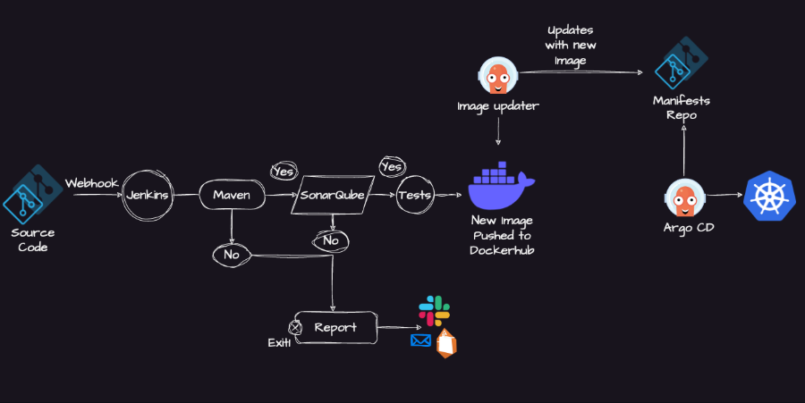
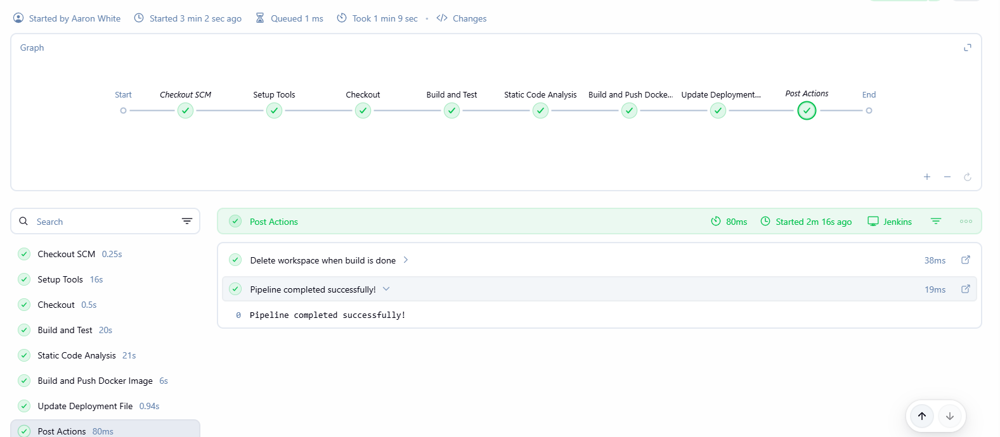
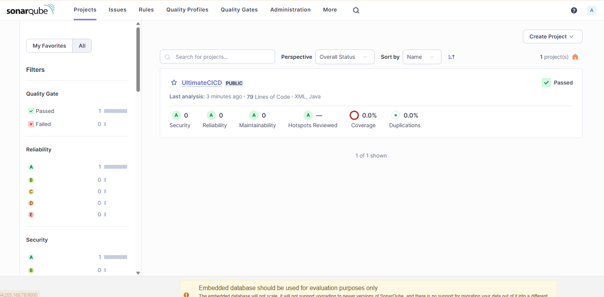
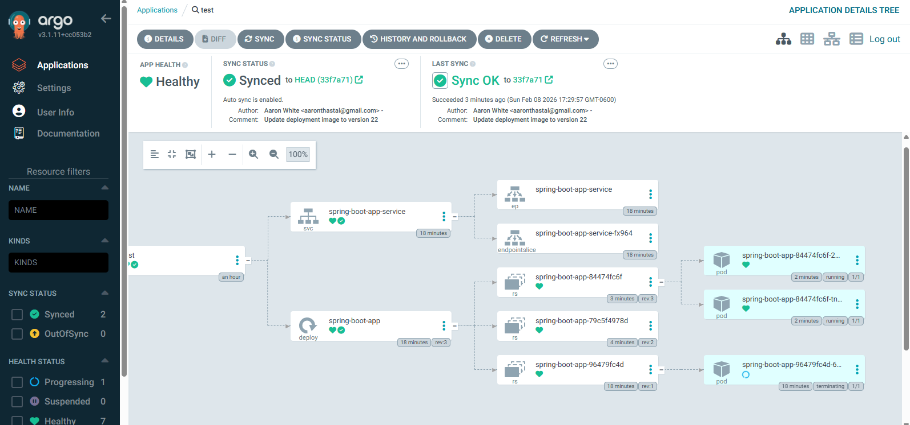
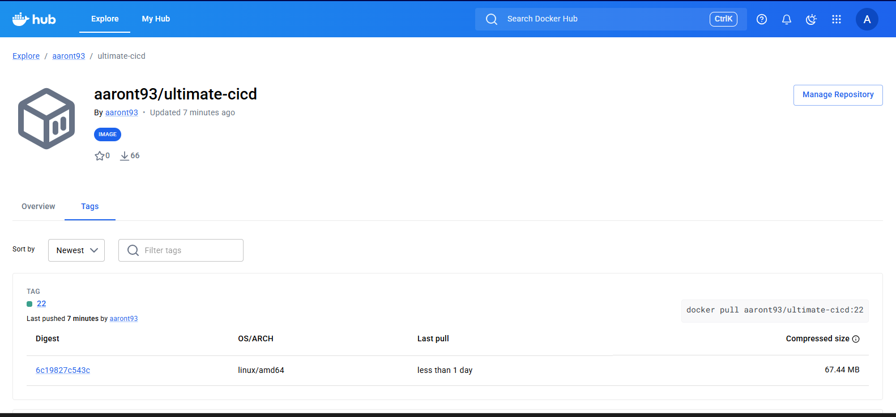

# Ultimate CI/CD Pipeline

A complete end-to-end CI/CD pipeline demonstrating GitOps principles with automated building, testing, security scanning, and deployment to Kubernetes.

## Architecture
GitHub → Jenkins → SonarQube → Docker Hub → ArgoCD → Kubernetes

text



## Technologies Used

| Tool | Purpose |
|------|---------|
| **Jenkins** | CI/CD orchestration |
| **SonarQube** | Static code analysis & security scanning |
| **Docker** | Containerization |
| **Docker Hub** | Container registry |
| **ArgoCD** | GitOps continuous delivery |
| **Kubernetes** | Container orchestration |
| **Minikube** | Local Kubernetes cluster |
| **Maven** | Java build tool |

## Pipeline Stages

1. **Checkout** - Clone source code from GitHub
2. **Build and Test** - Compile Java application with Maven
3. **Static Code Analysis** - Scan code quality with SonarQube
4. **Build and Push Docker Image** - Create container image and push to Docker Hub
5. **Update Deployment File** - Update Kubernetes manifest with new image tag
6. **GitOps Sync** - ArgoCD detects changes and deploys to Kubernetes

## Infrastructure Setup

| Component | Environment |
|-----------|-------------|
| Jenkins | AWS EC2 |
| SonarQube | AWS EC2 |
| ArgoCD | Minikube (Local) |
| Kubernetes | Minikube (Local) |

## Screenshots

### Jenkins Pipeline


### SonarQube Analysis


### ArgoCD Deployment


### Docker Hub Repository


## Key Achievements

- **Fully automated pipeline** - Code commit to production deployment with zero manual intervention
- **GitOps implementation** - ArgoCD monitors Git repository and automatically syncs cluster state
- **Security integration** - SonarQube scans for vulnerabilities and code smells
- **Infrastructure as Code** - All Kubernetes manifests stored in Git

## Challenges & Solutions

### OLM PackageServer Schema Error
**Problem:** ArgoCD failed with OpenAPI schema errors caused by Operator Lifecycle Manager's PackageServer exposing a broken API schema.

**Solution:** Identified the root cause through systematic debugging of Kubernetes APIServices. Removed the PackageServer components (APIService, Deployment, and ClusterServiceVersion) to resolve the conflict while maintaining ArgoCD Operator functionality.

This demonstrated:
- Deep understanding of Kubernetes API architecture
- Troubleshooting skills with CRDs and Operators
- Ability to make informed trade-offs in production systems

## Project Structure
├── java-maven-sonar-argocd-helm-k8s/
│ ├── spring-boot-app/ # Java application source code
│ │ ├── src/
│ │ ├── pom.xml
│ │ └── Dockerfile
│ └── spring-boot-app-manifests/ # Kubernetes manifests
│ ├── deployment.yml
│ └── service.yml
└── Jenkinsfile # Pipeline definition

text

## How to Run

### Prerequisites
- AWS Account (for EC2 instances)
- Docker Hub account
- GitHub account
- Local machine with Docker installed

### Setup Steps

1. **Launch Jenkins EC2**
   ```bash
   # Install Jenkins, Docker, Java 17
Launch SonarQube EC2

bash
docker run -d -p 9000:9000 sonarqube:lts-community
Setup Local Kubernetes

bash
minikube start --driver=docker
Install ArgoCD

bash
kubectl create namespace argocd
kubectl apply -n argocd -f argocd-install.yaml
Configure Jenkins Credentials

GitHub token
Docker Hub credentials
SonarQube token
Create ArgoCD Application

Point to your GitHub repository
Set target namespace
Enable auto-sync
Author
Aaron White

GitHub: @AaronWhiteTX
LinkedIn: https://www.linkedin.com/in/aaron-white-5a6a2686/
License
This project is for educational and portfolio purposes.


Want me to adjust anything?
